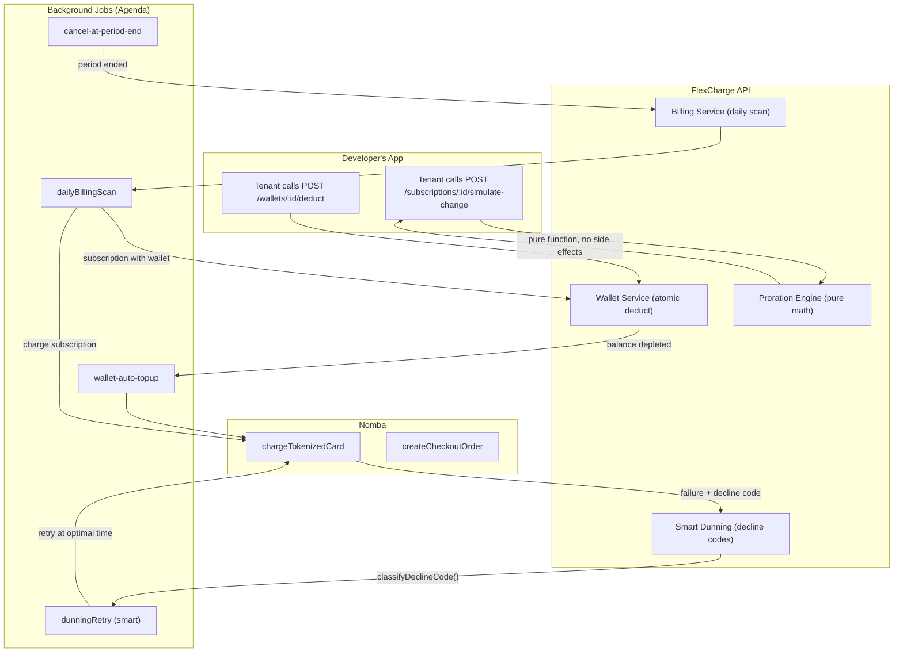

# FlexCharge — Novel Feature Implementation Blueprint

> **Purpose**: This document provides an exhaustive, field-level blueprint for implementing three novel features that will differentiate FlexCharge at the hackathon. Every schema, endpoint, algorithm, and edge case is specified here so that implementation is a matter of translation, not invention.
>
> **Constraint**: All designs are built to integrate seamlessly with the existing codebase (Express 5, TypeScript, Mongoose 9, Agenda, Zod) and the architecture defined in the [overall_implementation_plan.md](file:///C:/Users/HP/.gemini/antigravity-ide/brain/045d1948-f30e-4cb2-9a0b-58c3923ceee3/overall_implementation_plan.md).

---

## Table of Contents

1. [Feature 1: Credit Wallet System](#feature-1-credit-wallet-system)
2. [Feature 2: Proration Simulation API (Dry-Run)](#feature-2-proration-simulation-api-dry-run)
3. [Feature 3: Smart Predictive Dunning](#feature-3-smart-predictive-dunning)
4. [Integration Map: How All Three Features Fit Together](#integration-map)
5. [New Webhook Events (All Features)](#new-webhook-events)
6. [New Files & Modified Files Summary](#file-summary)

---

## Feature 1: Credit Wallet System

### 1.1 — Why This Wows Judges

Every AI startup in 2026 needs to bill for **consumption** (API calls, tokens, compute minutes), not just flat monthly fees. Platforms like Lago, Orb, and Metronome have made credit wallets a core primitive. By adding this to FlexCharge, we position the engine as a **next-generation** billing platform, not a Stripe clone. The judges will immediately see that FlexCharge solves the hardest problem in modern SaaS billing.

### 1.2 — Concept

A **Credit Wallet** is a pre-paid balance attached to a customer's subscription. The tenant's application (e.g., an AI chatbot) calls FlexCharge's API to **deduct credits** as the end-user consumes resources. When credits run low, FlexCharge fires webhooks. When credits hit zero, FlexCharge can optionally auto-charge the customer's tokenized card via Nomba to refill the wallet.

### 1.3 — Database Models

#### 1.3.1 — `Wallet` Model

> **File**: `server/src/models/Wallet.ts`

```
Wallet {
  _id:              ObjectId
  tenantId:         ObjectId → Tenant, required
  customerId:       ObjectId → Customer, required
  subscriptionId:   ObjectId → Subscription (nullable — wallets can exist independently)

  // === BALANCE (Atomic Field) ===
  balance:          Number, required, default: 0, min: 0    // current credit balance
  currency:         String, default: "NGN"

  // === CONFIGURATION ===
  creditValue:      Number, required, default: 100          // 1 credit = X kobo (e.g., 100 kobo = ₦1)
  lowBalanceThreshold: Number, default: 0                   // fire webhook when balance <= this
  autoTopUp:        Boolean, default: false                 // auto-charge when balance hits 0
  autoTopUpAmount:  Number                                  // how many credits to add on auto top-up
  autoTopUpTrigger: Number, default: 0                      // trigger auto top-up when balance <= this

  // === STATE ===
  isActive:         Boolean, default: true

  // === META ===
  metadata:         Mixed
  createdAt:        Date
  updatedAt:        Date
}

// Indexes:
// { tenantId: 1, customerId: 1 } — compound for fast lookups
// { tenantId: 1, subscriptionId: 1 } — find wallet by subscription
```

**Why `balance` is on the document (not derived):** Research confirms that for real-time authorization (can the user proceed?), you need a **synchronous balance check**. Deriving balance by replaying ledger entries on every request is too slow. The balance field is updated atomically via `findOneAndUpdate` + `$inc`, which MongoDB guarantees is race-condition-free on a single document.

#### 1.3.2 — `WalletTransaction` Model (Append-Only Ledger)

> **File**: `server/src/models/WalletTransaction.ts`

```
WalletTransaction {
  _id:              ObjectId
  tenantId:         ObjectId → Tenant, required
  walletId:         ObjectId → Wallet, required
  customerId:       ObjectId → Customer, required

  // === TRANSACTION ===
  type:             Enum: "credit" | "debit" | "auto_topup" | "manual_topup" | "refund" | "expiry"
  amount:           Number, required                        // always positive
  balanceAfter:     Number, required                        // snapshot of wallet balance after this tx
  description:      String                                  // "API call: gpt-4o-mini", "Manual top-up"

  // === IDEMPOTENCY ===
  idempotencyKey:   String, unique, sparse                  // prevents duplicate deductions

  // === REFERENCE ===
  invoiceId:        ObjectId → Invoice (nullable)           // if this tx generated an invoice (auto top-up)
  nombaOrderRef:    String (nullable)                       // if payment was involved

  // === META ===
  metadata:         Mixed                                   // { feature: "image-gen", model: "dall-e-3" }
  createdAt:        Date                                    // append-only: NO updatedAt
}

// Indexes:
// { walletId: 1, createdAt: -1 } — for listing transactions (most recent first)
// { idempotencyKey: 1 } — unique sparse for dedup
// { tenantId: 1, customerId: 1, createdAt: -1 } — tenant-scoped history
```

**Why append-only:** Research across Lago, Orb, and event-sourcing literature confirms: a financial ledger must be **immutable**. You never update or delete a `WalletTransaction`. If you need to reverse a deduction, you append a `refund` transaction. This gives 100% auditability and makes reconciliation trivial.

### 1.4 — Core Algorithm: Atomic Credit Deduction

This is the most critical piece of code in the wallet system. It must be **race-condition-proof** under concurrent requests.

```typescript
// wallet.service.ts — deductCredits()

async function deductCredits(params: {
  walletId: string;
  tenantId: string;
  amount: number;
  description: string;
  idempotencyKey: string;
  metadata?: Record<string, unknown>;
}): Promise<{ success: boolean; balanceAfter: number; transactionId: string }> {

  // Step 1: Check idempotency — if this key was already processed, return the original result
  const existing = await WalletTransaction.findOne({
    idempotencyKey: params.idempotencyKey,
  });
  if (existing) {
    return {
      success: true,
      balanceAfter: existing.balanceAfter,
      transactionId: existing._id.toString(),
    };
  }

  // Step 2: Atomic conditional decrement
  // MongoDB guarantees this is a single atomic operation.
  // If balance < amount, the query won't match and returns null.
  const wallet = await Wallet.findOneAndUpdate(
    {
      _id: params.walletId,
      tenantId: params.tenantId,
      isActive: true,
      balance: { $gte: params.amount },      // ← THE GUARD
    },
    {
      $inc: { balance: -params.amount },      // ← ATOMIC DECREMENT
    },
    {
      new: true,                              // return updated document
    }
  );

  if (!wallet) {
    // Balance was insufficient or wallet not found
    // Check if wallet exists but just didn't have enough balance
    const walletExists = await Wallet.findOne({
      _id: params.walletId,
      tenantId: params.tenantId,
    });

    if (!walletExists) throw new NotFoundError("Wallet");
    if (!walletExists.isActive) throw new AppError("Wallet is deactivated", 403);

    // Insufficient balance — fire webhook event
    await webhookService.deliverEvent(params.tenantId, "wallet.balance.insufficient", {
      walletId: params.walletId,
      currentBalance: walletExists.balance,
      requestedAmount: params.amount,
      shortfall: params.amount - walletExists.balance,
    });

    throw new AppError(
      `Insufficient credits. Current balance: ${walletExists.balance}, requested: ${params.amount}`,
      402  // 402 Payment Required — semantically perfect
    );
  }

  // Step 3: Append ledger entry
  const transaction = await WalletTransaction.create({
    tenantId: params.tenantId,
    walletId: wallet._id,
    customerId: wallet.customerId,
    type: "debit",
    amount: params.amount,
    balanceAfter: wallet.balance,             // already decremented (we used { new: true })
    description: params.description,
    idempotencyKey: params.idempotencyKey,
    metadata: params.metadata,
  });

  // Step 4: Check thresholds and fire webhooks
  if (wallet.balance <= 0) {
    await webhookService.deliverEvent(params.tenantId, "wallet.balance.depleted", {
      walletId: wallet._id,
      customerId: wallet.customerId,
    });

    // Trigger auto top-up if configured
    if (wallet.autoTopUp && wallet.autoTopUpAmount) {
      await agenda.now("wallet-auto-topup", {
        walletId: wallet._id.toString(),
        tenantId: params.tenantId,
      });
    }
  } else if (
    wallet.lowBalanceThreshold > 0 &&
    wallet.balance <= wallet.lowBalanceThreshold
  ) {
    await webhookService.deliverEvent(params.tenantId, "wallet.balance.low", {
      walletId: wallet._id,
      customerId: wallet.customerId,
      currentBalance: wallet.balance,
      threshold: wallet.lowBalanceThreshold,
    });
  }

  return {
    success: true,
    balanceAfter: wallet.balance,
    transactionId: transaction._id.toString(),
  };
}
```

**Why this is perfect:**
- **Race-condition-proof:** MongoDB's `findOneAndUpdate` is atomic on a single document. Two concurrent requests will never both succeed if only one has enough balance.
- **Idempotent:** The `idempotencyKey` check at the top ensures that network retries from the tenant's application never result in double-deductions.
- **Auditable:** Every deduction creates an immutable `WalletTransaction` with `balanceAfter` snapshot.
- **Event-driven:** Threshold breaches trigger webhooks immediately, so the tenant can react (show "low credits" banner, auto-refill, etc.).

### 1.5 — REST API Surface

| Method | Endpoint | Description | Auth | Notes |
|--------|----------|-------------|------|-------|
| `POST` | `/wallets` | Create a wallet for a customer | API Key | Optionally link to a subscription |
| `GET` | `/wallets` | List wallets (filterable by customerId) | API Key | Paginated |
| `GET` | `/wallets/:id` | Get wallet details + current balance | API Key | |
| `PATCH` | `/wallets/:id` | Update config (thresholds, auto-topup) | API Key | Cannot modify balance directly |
| `POST` | `/wallets/:id/topup` | Add credits to a wallet | API Key | Creates `manual_topup` ledger entry |
| `POST` | `/wallets/:id/deduct` | **Deduct credits (the hot path)** | API Key | Requires `idempotencyKey` header |
| `GET` | `/wallets/:id/transactions` | List transaction history (ledger) | API Key | Paginated, most recent first |
| `GET` | `/wallets/:id/balance` | Quick balance check (lightweight) | API Key | Returns only `{ balance, currency }` |

### 1.6 — Zod Validators

```typescript
// validators/wallet.validator.ts

export const createWalletSchema = z.object({
  body: z.object({
    customerId:          z.string().regex(/^[a-f\d]{24}$/i, "Invalid customer ID"),
    subscriptionId:      z.string().regex(/^[a-f\d]{24}$/i).optional(),
    creditValue:         z.number().int().positive().default(100),
    lowBalanceThreshold: z.number().int().min(0).default(0),
    autoTopUp:           z.boolean().default(false),
    autoTopUpAmount:     z.number().int().positive().optional(),
    autoTopUpTrigger:    z.number().int().min(0).default(0),
    initialBalance:      z.number().int().min(0).default(0),
    metadata:            z.record(z.unknown()).optional(),
  }).refine(
    (data) => !data.autoTopUp || (data.autoTopUpAmount && data.autoTopUpAmount > 0),
    { message: "autoTopUpAmount is required when autoTopUp is true" }
  ),
});

export const deductCreditsSchema = z.object({
  body: z.object({
    amount:      z.number().int().positive("Deduction amount must be positive"),
    description: z.string().min(1).max(500),
    metadata:    z.record(z.unknown()).optional(),
  }),
  headers: z.object({
    "x-idempotency-key": z.string().min(1, "x-idempotency-key header is required"),
  }).passthrough(),
});

export const topupWalletSchema = z.object({
  body: z.object({
    amount:      z.number().int().positive("Top-up amount must be positive"),
    description: z.string().max(500).optional(),
    metadata:    z.record(z.unknown()).optional(),
  }),
});
```

### 1.7 — Developer UX Design Decisions

| Decision | Rationale |
|----------|-----------|
| **`402 Payment Required`** for insufficient balance | Semantically correct HTTP status. Developers immediately understand the issue without reading the body. |
| **Idempotency key in header** (`x-idempotency-key`) | Following Stripe's convention. Developers already know this pattern. Keeps the request body clean. |
| **`balanceAfter` in every response** | Eliminates the need for a follow-up `GET /balance` call. Reduces latency for the developer's hot path. |
| **`/wallets/:id/balance` as a lightweight endpoint** | Returns only `{ balance, currency }`. Optimized for high-frequency polling (e.g., real-time UI balance display). |
| **Metadata on transactions** | Lets developers attach arbitrary context (e.g., `{ model: "gpt-4o", feature: "summarize" }`) for their own analytics. No schema lock-in. |
| **Auto top-up via Agenda job** | The deduction response returns instantly. The Nomba charge happens asynchronously in the background. The developer's user never waits for a payment to complete mid-request. |

### 1.8 — Integration with Existing Plan Model

The `Plan` model already has a `features: [String]` field. We extend the concept by adding an optional `creditsPerCycle` field to the plan:

```
// Addition to Plan schema (NOT a new model)
creditsPerCycle:  Number, default: 0    // e.g., 5000 = this plan grants 5000 credits/month
```

**How it works:**
- When a subscription is renewed (daily billing scan succeeds), the billing engine automatically calls `walletService.topupCredits(wallet, plan.creditsPerCycle, "auto_topup")`.
- This creates a `WalletTransaction` of type `auto_topup` in the ledger.
- The developer doesn't have to manage credit refills — FlexCharge does it as part of the billing cycle.

### 1.9 — Agenda Job: `wallet-auto-topup`

```
Job: wallet-auto-topup
Trigger: Fired when wallet balance hits 0 (or autoTopUpTrigger threshold)
Logic:
  1. Load wallet + subscription + customer
  2. Calculate amount in kobo: wallet.autoTopUpAmount * wallet.creditValue
  3. Call nomba.chargeTokenizedCard(subscription.tokenKey, amount)
  4. On success:
     - Create Invoice (status: "paid", description: "Wallet auto top-up")
     - Call walletService.topupCredits(wallet, autoTopUpAmount)
     - Deliver webhook: "wallet.topped_up"
  5. On failure:
     - Deliver webhook: "wallet.topup_failed"
     - Do NOT enter dunning — this is a top-up, not a subscription renewal
```

---

## Feature 2: Proration Simulation API (Dry-Run)

### 2.1 — Why This Wows Judges

Stripe's `GET /v1/invoices/upcoming` with plan change parameters is one of the most praised developer features in the entire billing industry. No other subscription engine built on African payment rails offers this. By implementing it in FlexCharge, we give developers a tool they've only seen in Stripe — and we do it on Nomba.

### 2.2 — Concept

A **dry-run simulation** endpoint that accepts a hypothetical plan change and returns the **exact invoice** that would be generated — without charging the customer or modifying the subscription. Developers use this to display transparent "Due Today" breakdowns in their checkout UIs.

### 2.3 — The Pure Proration Engine

This is the mathematical core. It must be a **pure function** — no database writes, no side effects. Just math.

```typescript
// utils/proration.ts

interface ProrationInput {
  oldPlanAmount:        number;    // in kobo
  newPlanAmount:        number;    // in kobo
  currentPeriodStart:   Date;
  currentPeriodEnd:     Date;
  changeDate:           Date;      // when the change would take effect (usually "now")
  newPlanInterval:      PlanInterval;
}

interface ProrationResult {
  type:                 "upgrade" | "downgrade" | "equivalent";

  // The math
  totalDaysInPeriod:    number;
  daysUsed:             number;
  daysRemaining:        number;

  unusedCredit:         number;    // kobo — value of unused days on old plan
  newPlanCostRemaining: number;    // kobo — cost of remaining days on new plan

  amountDue:            number;    // kobo — what to charge now (can be negative = credit)
  credit:               number;    // kobo — if downgrade, credit to store

  // Line items (for transparent display)
  lineItems: Array<{
    description:  string;
    amount:       number;          // kobo (negative for credits)
    isProration:  boolean;
    period: {
      start: string;              // ISO date
      end:   string;              // ISO date
    };
  }>;
}

function calculateProration(input: ProrationInput): ProrationResult {
  const { oldPlanAmount, newPlanAmount, currentPeriodStart, currentPeriodEnd, changeDate } = input;

  const totalDaysInPeriod = Math.ceil(
    (currentPeriodEnd.getTime() - currentPeriodStart.getTime()) / (1000 * 60 * 60 * 24)
  );

  const daysUsed = Math.ceil(
    (changeDate.getTime() - currentPeriodStart.getTime()) / (1000 * 60 * 60 * 24)
  );

  const daysRemaining = totalDaysInPeriod - daysUsed;

  // Daily rates
  const oldDailyRate = oldPlanAmount / totalDaysInPeriod;
  const newDailyRate = newPlanAmount / totalDaysInPeriod;  // use same period for fairness

  // Unused credit on old plan
  const unusedCredit = Math.round(oldDailyRate * daysRemaining);

  // Cost of remaining days on new plan
  const newPlanCostRemaining = Math.round(newDailyRate * daysRemaining);

  // Net amount due
  const netAmount = newPlanCostRemaining - unusedCredit;

  const type = netAmount > 0 ? "upgrade" : netAmount < 0 ? "downgrade" : "equivalent";

  // Build transparent line items (Stripe-style)
  const lineItems = [
    {
      description: `Unused time on previous plan (${daysRemaining} days)`,
      amount: -unusedCredit,  // negative = credit
      isProration: true,
      period: {
        start: changeDate.toISOString(),
        end: currentPeriodEnd.toISOString(),
      },
    },
    {
      description: `Remaining time on new plan (${daysRemaining} days)`,
      amount: newPlanCostRemaining,
      isProration: true,
      period: {
        start: changeDate.toISOString(),
        end: currentPeriodEnd.toISOString(),
      },
    },
  ];

  return {
    type,
    totalDaysInPeriod,
    daysUsed,
    daysRemaining,
    unusedCredit,
    newPlanCostRemaining,
    amountDue: Math.max(0, netAmount),
    credit: Math.max(0, -netAmount),
    lineItems,
  };
}
```

### 2.4 — REST API Surface

| Method | Endpoint | Description | Auth |
|--------|----------|-------------|------|
| `POST` | `/subscriptions/:id/simulate-change` | Preview a plan change (dry-run) | API Key |

### 2.5 — Request / Response Contract

**Request:**
```json
POST /subscriptions/sub_abc123/simulate-change
{
  "newPlanId": "plan_xyz789",
  "changeDate": "2026-06-24T16:00:00Z"   // optional, defaults to "now"
}
```

**Response (200):**
```json
{
  "success": true,
  "data": {
    "simulation": true,
    "warning": "This is a preview. No charges have been made.",

    "subscription": {
      "id": "sub_abc123",
      "currentPlanId": "plan_old456",
      "currentPlanName": "Basic Monthly",
      "newPlanId": "plan_xyz789",
      "newPlanName": "Pro Monthly"
    },

    "proration": {
      "type": "upgrade",
      "changeDate": "2026-06-24T16:00:00Z",
      "currentPeriod": {
        "start": "2026-06-01T00:00:00Z",
        "end": "2026-07-01T00:00:00Z"
      },
      "totalDaysInPeriod": 30,
      "daysUsed": 24,
      "daysRemaining": 6,
      "unusedCredit": 100000,
      "newPlanCostRemaining": 200000
    },

    "invoice": {
      "lineItems": [
        {
          "description": "Unused time on Basic Monthly (6 days)",
          "amount": -100000,
          "amountFormatted": "-₦1,000.00",
          "isProration": true,
          "period": {
            "start": "2026-06-24T16:00:00Z",
            "end": "2026-07-01T00:00:00Z"
          }
        },
        {
          "description": "Remaining time on Pro Monthly (6 days)",
          "amount": 200000,
          "amountFormatted": "₦2,000.00",
          "isProration": true,
          "period": {
            "start": "2026-06-24T16:00:00Z",
            "end": "2026-07-01T00:00:00Z"
          }
        }
      ],
      "subtotal": 100000,
      "subtotalFormatted": "₦1,000.00",
      "amountDue": 100000,
      "amountDueFormatted": "₦1,000.00",
      "credit": 0,
      "creditFormatted": "₦0.00",
      "currency": "NGN"
    },

    "nextBillingDate": "2026-07-01T00:00:00Z",
    "nextBillingAmount": 1000000,
    "nextBillingAmountFormatted": "₦10,000.00"
  }
}
```

### 2.6 — Zod Validator

```typescript
// validators/subscription.validator.ts

export const simulateChangeSchema = z.object({
  params: z.object({
    id: z.string().regex(/^[a-f\d]{24}$/i, "Invalid subscription ID"),
  }),
  body: z.object({
    newPlanId:  z.string().regex(/^[a-f\d]{24}$/i, "Invalid plan ID"),
    changeDate: z.string().datetime().optional(),  // ISO 8601, defaults to now
  }),
});
```

### 2.7 — Controller Logic (Pseudocode)

```typescript
// controllers/subscription.controller.ts — simulateChange()

async function simulateChange(req, res) {
  const { id } = req.params;
  const { newPlanId, changeDate } = req.body;
  const tenantId = req.tenant._id;

  // 1. Load current subscription (tenant-scoped)
  const subscription = await Subscription.findOne({ _id: id, tenantId });
  if (!subscription) throw new NotFoundError("Subscription");
  if (subscription.status !== "active" && subscription.status !== "trialing")
    throw new AppError("Can only simulate changes for active subscriptions", 400);

  // 2. Load both plans
  const [currentPlan, newPlan] = await Promise.all([
    Plan.findOne({ _id: subscription.planId, tenantId }),
    Plan.findOne({ _id: newPlanId, tenantId, isActive: true }),
  ]);
  if (!currentPlan) throw new NotFoundError("Current plan");
  if (!newPlan) throw new NotFoundError("New plan");

  // 3. Pure calculation — NO side effects
  const effectiveChangeDate = changeDate ? new Date(changeDate) : new Date();
  const result = calculateProration({
    oldPlanAmount: currentPlan.amount,
    newPlanAmount: newPlan.amount,
    currentPeriodStart: subscription.currentPeriodStart,
    currentPeriodEnd: subscription.currentPeriodEnd,
    changeDate: effectiveChangeDate,
    newPlanInterval: newPlan.interval,
  });

  // 4. Format response with human-readable amounts
  const formatKobo = (kobo: number) => {
    const naira = kobo / 100;
    const sign = naira < 0 ? "-" : "";
    return `${sign}₦${Math.abs(naira).toLocaleString("en-NG", {
      minimumFractionDigits: 2,
    })}`;
  };

  // 5. Return simulation (never touches the database for writes)
  return sendSuccess(res, {
    simulation: true,
    warning: "This is a preview. No charges have been made.",
    subscription: {
      id: subscription._id,
      currentPlanId: currentPlan._id,
      currentPlanName: currentPlan.name,
      newPlanId: newPlan._id,
      newPlanName: newPlan.name,
    },
    proration: {
      type: result.type,
      changeDate: effectiveChangeDate.toISOString(),
      currentPeriod: {
        start: subscription.currentPeriodStart.toISOString(),
        end: subscription.currentPeriodEnd.toISOString(),
      },
      ...result,
    },
    invoice: {
      lineItems: result.lineItems.map((li) => ({
        ...li,
        amountFormatted: formatKobo(li.amount),
      })),
      subtotal: result.amountDue - result.credit,
      subtotalFormatted: formatKobo(result.amountDue - result.credit),
      amountDue: result.amountDue,
      amountDueFormatted: formatKobo(result.amountDue),
      credit: result.credit,
      creditFormatted: formatKobo(result.credit),
      currency: currentPlan.currency,
    },
    nextBillingDate: subscription.currentPeriodEnd.toISOString(),
    nextBillingAmount: newPlan.amount,
    nextBillingAmountFormatted: formatKobo(newPlan.amount),
  });
}
```

### 2.8 — Developer UX Design Decisions

| Decision | Rationale |
|----------|-----------|
| **`simulation: true` flag** in every response | Makes it impossible for a developer to accidentally mistake a preview for a real charge. |
| **`amountFormatted` alongside `amount`** | Developers can display the formatted string directly in their UI without writing Kobo-to-Naira conversion logic. Massive DX improvement. |
| **Line items with `period` objects** | Developers can render a transparent "Due Today" breakdown on their checkout page. Builds user trust. |
| **`changeDate` parameter** | Developers can simulate "what if the customer upgrades tomorrow?" scenarios. Powers forward-looking planning UIs. |
| **Read-only (GET-like behavior via POST)** | POST because it accepts a body, but it never modifies state. The `simulation: true` flag and `warning` field make this crystal clear. |

---

## Feature 3: Smart Predictive Dunning

### 3.1 — Why This Wows Judges

Static dunning (retry Day 1, Day 3, Day 7) is what every billing tutorial teaches. **Smart dunning** is what Chargebee, Recurly, and enterprise platforms charge premium prices for. By mapping Nomba's decline reason codes to intelligent retry schedules — and firing targeted webhooks that help tenants communicate with their customers — FlexCharge demonstrates production-grade sophistication.

### 3.2 — Concept

When a charge fails, FlexCharge does NOT blindly schedule a retry in 24 hours. Instead, it:

1. **Inspects the decline reason** (ISO 8583 codes from Nomba).
2. **Classifies the decline** as "soft" (retryable) or "hard" (not retryable).
3. **Selects an optimal retry strategy** based on the classification.
4. **Enriches the webhook payload** with actionable context so the tenant knows what to tell their customer.

### 3.3 — Decline Code Classification Map

> **File**: `server/src/config/declineCodeMap.ts`

```typescript
export type DeclineCategory =
  | "insufficient_funds"
  | "card_expired"
  | "card_lost_stolen"
  | "do_not_honor"
  | "fraud_suspected"
  | "technical_error"
  | "velocity_limit"
  | "invalid_card"
  | "unknown";

export type DeclineType = "soft" | "hard";

export interface DeclineClassification {
  category:       DeclineCategory;
  type:           DeclineType;
  retryable:      boolean;
  maxRetries:     number;
  retryStrategy:  RetryStrategy;
  customerAction: string;           // human-readable suggestion for the tenant to show their user
}

export type RetryStrategy =
  | "immediate"         // retry within 1-5 minutes (technical errors)
  | "next_day"          // retry in 24 hours
  | "payday_aligned"    // retry on the 1st or 15th of the month
  | "escalating"        // 1d → 3d → 7d → 14d
  | "no_retry";         // hard decline, require card update

/**
 * Maps ISO 8583 response codes (and Nomba-specific codes) to classifications.
 *
 * Sources:
 * - ISO 8583 standard
 * - Nomba developer documentation
 * - Visa/Mastercard retry guidelines
 */
export const DECLINE_CODE_MAP: Record<string, DeclineClassification> = {
  // === SOFT DECLINES (Retryable) ===
  "51": {
    category: "insufficient_funds",
    type: "soft",
    retryable: true,
    maxRetries: 4,
    retryStrategy: "payday_aligned",
    customerAction: "Please ensure sufficient funds are available in your account.",
  },
  "05": {
    category: "do_not_honor",
    type: "soft",
    retryable: true,
    maxRetries: 3,
    retryStrategy: "next_day",
    customerAction: "Your bank declined this transaction. Please contact your bank or try a different card.",
  },
  "65": {
    category: "velocity_limit",
    type: "soft",
    retryable: true,
    maxRetries: 2,
    retryStrategy: "next_day",
    customerAction: "Your card's daily limit has been reached. The charge will be retried tomorrow.",
  },
  "91": {
    category: "technical_error",
    type: "soft",
    retryable: true,
    maxRetries: 3,
    retryStrategy: "immediate",
    customerAction: "A temporary network issue occurred. We are retrying automatically.",
  },
  "96": {
    category: "technical_error",
    type: "soft",
    retryable: true,
    maxRetries: 3,
    retryStrategy: "immediate",
    customerAction: "A system malfunction occurred. We are retrying automatically.",
  },

  // === HARD DECLINES (Not Retryable) ===
  "54": {
    category: "card_expired",
    type: "hard",
    retryable: false,
    maxRetries: 0,
    retryStrategy: "no_retry",
    customerAction: "Your card has expired. Please update your payment method.",
  },
  "41": {
    category: "card_lost_stolen",
    type: "hard",
    retryable: false,
    maxRetries: 0,
    retryStrategy: "no_retry",
    customerAction: "This card has been reported lost. Please use a different card.",
  },
  "43": {
    category: "card_lost_stolen",
    type: "hard",
    retryable: false,
    maxRetries: 0,
    retryStrategy: "no_retry",
    customerAction: "This card has been reported stolen. Please use a different card.",
  },
  "14": {
    category: "invalid_card",
    type: "hard",
    retryable: false,
    maxRetries: 0,
    retryStrategy: "no_retry",
    customerAction: "The card number is invalid. Please update your payment method.",
  },
  "59": {
    category: "fraud_suspected",
    type: "hard",
    retryable: false,
    maxRetries: 0,
    retryStrategy: "no_retry",
    customerAction: "This transaction was flagged by your bank. Please contact your bank or use a different card.",
  },
};

/**
 * Fallback for unknown codes.
 * Conservative: treat as soft with escalating retry.
 */
export const DEFAULT_CLASSIFICATION: DeclineClassification = {
  category: "unknown",
  type: "soft",
  retryable: true,
  maxRetries: 3,
  retryStrategy: "escalating",
  customerAction: "We were unable to process your payment. We will retry automatically.",
};

export function classifyDeclineCode(code: string): DeclineClassification {
  return DECLINE_CODE_MAP[code] || DEFAULT_CLASSIFICATION;
}
```

### 3.4 — Retry Timing Engine

> **File**: `server/src/services/dunning.service.ts`

```typescript
/**
 * Calculates the optimal retry date based on the decline classification
 * and the current attempt number.
 */
function calculateNextRetryDate(
  classification: DeclineClassification,
  attemptNumber: number,
  now: Date = new Date()
): Date | null {
  if (!classification.retryable || attemptNumber >= classification.maxRetries) {
    return null; // No more retries
  }

  switch (classification.retryStrategy) {
    case "immediate":
      // Technical errors — retry in 2-5 minutes
      return new Date(now.getTime() + (2 + Math.random() * 3) * 60 * 1000);

    case "next_day":
      // Retry in 24 hours
      return new Date(now.getTime() + 24 * 60 * 60 * 1000);

    case "payday_aligned": {
      // For insufficient funds: retry on the next 1st or 15th of the month
      const day = now.getDate();
      const nextPayday = new Date(now);

      if (day < 15) {
        nextPayday.setDate(15);
      } else {
        // Next month's 1st
        nextPayday.setMonth(nextPayday.getMonth() + 1);
        nextPayday.setDate(1);
      }
      // Set to 9:00 AM local time (optimal for payday charges)
      nextPayday.setHours(9, 0, 0, 0);
      return nextPayday;
    }

    case "escalating": {
      // Escalating backoff: 1d → 3d → 7d → 14d
      const ESCALATION_DAYS = [1, 3, 7, 14];
      const delayDays = ESCALATION_DAYS[attemptNumber] || 14;
      return new Date(now.getTime() + delayDays * 24 * 60 * 60 * 1000);
    }

    case "no_retry":
    default:
      return null;
  }
}
```

### 3.5 — Enhanced Dunning Webhook Payloads

The key DX improvement: instead of just saying "payment failed," we tell the tenant **why** it failed and **what their customer should do**.

**Current dunning webhook (baseline plan):**
```json
{
  "event": "subscription.payment_failed",
  "data": {
    "subscriptionId": "sub_xyz",
    "status": "past_due"
  }
}
```

**Enhanced smart dunning webhook:**
```json
{
  "event": "subscription.payment_failed",
  "data": {
    "subscriptionId": "sub_xyz",
    "customerId": "cus_123",
    "status": "past_due",
    "invoiceId": "inv_abc",
    "amount": 500000,
    "currency": "NGN",

    "decline": {
      "code": "51",
      "category": "insufficient_funds",
      "type": "soft",
      "retryable": true,
      "customerAction": "Please ensure sufficient funds are available in your account."
    },

    "dunning": {
      "attemptNumber": 1,
      "maxAttempts": 4,
      "nextRetryAt": "2026-07-01T09:00:00Z",
      "retryStrategy": "payday_aligned",
      "retryStrategyExplanation": "Retrying on the next payday (1st or 15th) for maximum success probability."
    }
  }
}
```

**Why this is a game-changer for developer UX:**
- The `customerAction` string is ready to be dropped directly into an email template or in-app notification. The tenant developer doesn't have to write decline-code-to-message mappings themselves.
- The `retryStrategy` and `nextRetryAt` give the developer full visibility into what FlexCharge is doing automatically.
- The `type: "hard"` flag tells the developer to immediately prompt for a card update instead of waiting for retries.

### 3.6 — Integration with Existing Dunning Flow

The existing plan defines dunning in `dunningRetry.ts` Agenda job and `DunningAttempt` model. Smart dunning enhances it without breaking the architecture:

```
// Modified flow in billing.service.ts — onChargeFailed()

1. Receive failure from Nomba (with response code)
2. Call classifyDeclineCode(nombaResponseCode)
3. Create DunningAttempt with NEW fields:
   - declineCode:      "51"
   - declineCategory:  "insufficient_funds"
   - declineType:      "soft"
   - retryStrategy:    "payday_aligned"
4. Calculate nextRetryDate using calculateNextRetryDate()
5. If nextRetryDate is null:
   → Hard decline. Skip dunning. Set subscription → "unpaid"
   → Deliver webhook with decline.type = "hard" + customerAction
6. If nextRetryDate is set:
   → Schedule Agenda job: dunningRetry at nextRetryDate
   → Deliver webhook with full decline context + dunning schedule
```

### 3.7 — DunningAttempt Model Additions

Extend the existing `DunningAttempt` model from the overall plan with these new fields:

```
// Additions to DunningAttempt schema
declineCode:        String              // ISO 8583 code from Nomba
declineCategory:    String              // "insufficient_funds", "card_expired", etc.
declineType:        String              // "soft" or "hard"
retryStrategy:      String              // "payday_aligned", "immediate", etc.
```

### 3.8 — Developer UX Design Decisions

| Decision | Rationale |
|----------|-----------|
| **`customerAction` as a ready-to-use string** | Developers can paste it directly into their email templates. Eliminates the need for them to maintain their own decline code → message mapping. |
| **`retryStrategyExplanation` in webhooks** | Developers (and their support teams) can explain to customers exactly when and why the next charge will happen. Builds trust. |
| **Payday-aligned retries for insufficient funds** | Research shows that retrying on the 1st or 15th of the month (common paydays) dramatically increases recovery rates for "insufficient funds" declines. |
| **Immediate retries for technical errors** | Technical/network errors are transient. Retrying in 2-5 minutes (with jitter to prevent thundering herd) recovers most of these silently. |
| **Hard decline = no retry + immediate webhook** | Prevents wasting Nomba API calls on charges that will never succeed. Visa/Mastercard can fine merchants for excessive reattempts on hard declines. |

---

## Integration Map

### How All Three Features Fit Together



### Interaction Between Credit Wallet and Billing Scan

When a subscription with a linked wallet renews:

1. **Daily billing scan** finds the subscription is due.
2. It charges the customer via Nomba (tokenized card) for the plan amount.
3. **On success**: The billing engine calls `walletService.topupCredits(wallet, plan.creditsPerCycle)` to refill the wallet automatically.
4. The wallet's `WalletTransaction` ledger gets a new `auto_topup` entry.
5. Webhook `subscription.renewed` fires — includes `creditsGranted: 5000` in the payload.

### Interaction Between Simulation API and Actual Plan Change

1. Developer calls `POST /subscriptions/:id/simulate-change` — gets the preview.
2. Developer shows the breakdown to their user.
3. User confirms.
4. Developer calls `POST /subscriptions/:id/change-plan` — executes the actual change.
5. FlexCharge uses the **exact same `calculateProration()` function** for the real change, ensuring the preview and the actual charge are mathematically identical.

---

## New Webhook Events

| Event | Feature | Triggered When |
|-------|---------|----------------|
| `wallet.balance.low` | Credit Wallet | Balance drops below `lowBalanceThreshold` |
| `wallet.balance.depleted` | Credit Wallet | Balance reaches 0 |
| `wallet.balance.insufficient` | Credit Wallet | Deduction requested but balance too low |
| `wallet.topped_up` | Credit Wallet | Auto top-up or manual top-up succeeds |
| `wallet.topup_failed` | Credit Wallet | Auto top-up charge via Nomba failed |

These extend the existing `WEBHOOK_EVENTS` array in [subscription.types.ts](file:///c:/Users/HP/Documents/New%20folder/flexcharge-engine/server/src/types/subscription.types.ts).

> [!NOTE]
> The smart dunning feature does NOT add new event names — it **enriches** the existing `subscription.payment_failed` and `subscription.unpaid` payloads with decline context. This is intentional: downstream webhook consumers who already handle these events get better data without changing their code.

---

## New Files & Modified Files Summary

### New Files to Create

| File | Feature | Purpose |
|------|---------|---------|
| `models/Wallet.ts` | Credit Wallet | Wallet schema with atomic balance field |
| `models/WalletTransaction.ts` | Credit Wallet | Append-only ledger schema |
| `services/wallet.service.ts` | Credit Wallet | Deduct, topup, balance check logic |
| `controllers/wallet.controller.ts` | Credit Wallet | REST endpoint handlers |
| `routes/wallet.routes.ts` | Credit Wallet | Route definitions |
| `validators/wallet.validator.ts` | Credit Wallet | Zod schemas for wallet endpoints |
| `jobs/walletAutoTopup.ts` | Credit Wallet | Agenda job for auto-recharge |
| `config/declineCodeMap.ts` | Smart Dunning | ISO 8583 → classification mapping |
| `utils/proration.ts` | Simulation API | Pure proration calculation function |
| `validators/subscription.validator.ts` | Simulation API | Zod schema for simulate-change |

### Existing Files to Modify

| File | Feature | Change |
|------|---------|--------|
| `models/Plan.ts` | Credit Wallet | Add `creditsPerCycle` optional field |
| `types/subscription.types.ts` | All | Add new webhook event types for wallet |
| `services/webhook.service.ts` | All | Support new event types |
| `app.ts` | Credit Wallet | Register wallet routes |
| `controllers/subscription.controller.ts` | Simulation API | Add `simulateChange` handler |
| `routes/subscription.routes.ts` | Simulation API | Add simulate-change route |
| `services/dunning.service.ts` | Smart Dunning | Add decline classification + smart scheduling |
| `jobs/dunningRetry.ts` | Smart Dunning | Use smart retry timing instead of static delays |
| `services/billing.service.ts` | All | Integrate wallet top-up on renewal, smart dunning on failure |

---

## Open Questions

> [!IMPORTANT]
> **1. Which features do you want to implement?** All three are designed to work independently, so we can implement any subset. My recommendation is all three — they compound each other's impact.

> [!IMPORTANT]
> **2. Auto top-up behavior on failure:** If the auto-top-up Nomba charge fails, should we enter a dunning-like retry flow for the top-up, or simply notify the tenant and let them handle it? (I recommend: notify only, no dunning for top-ups — keeps it simple.)

> [!NOTE]
> **3. Credit expiry:** Should credits expire at the end of a billing cycle (use-it-or-lose-it) or roll over? Lago supports both. For the hackathon, I recommend rollover (simpler to implement, more developer-friendly).
