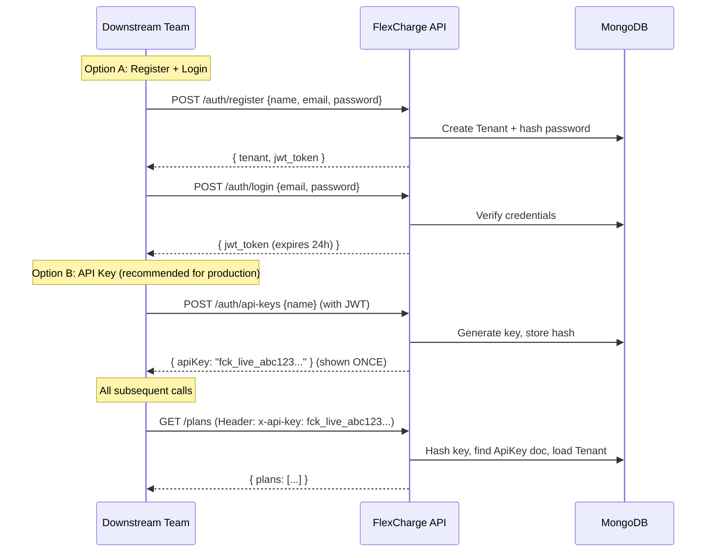
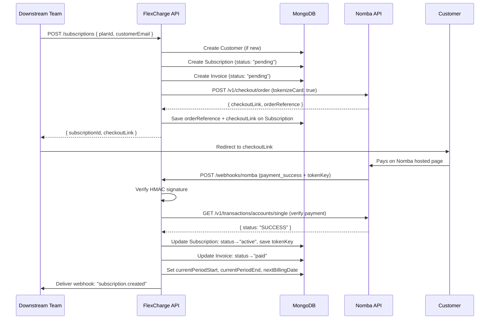
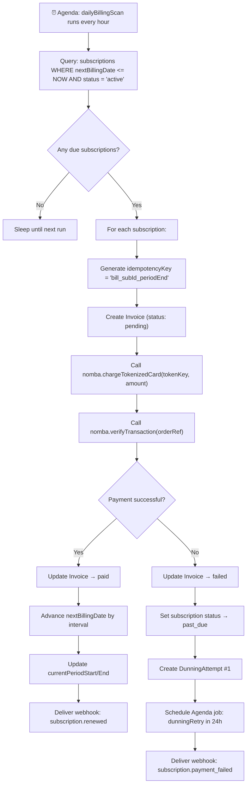
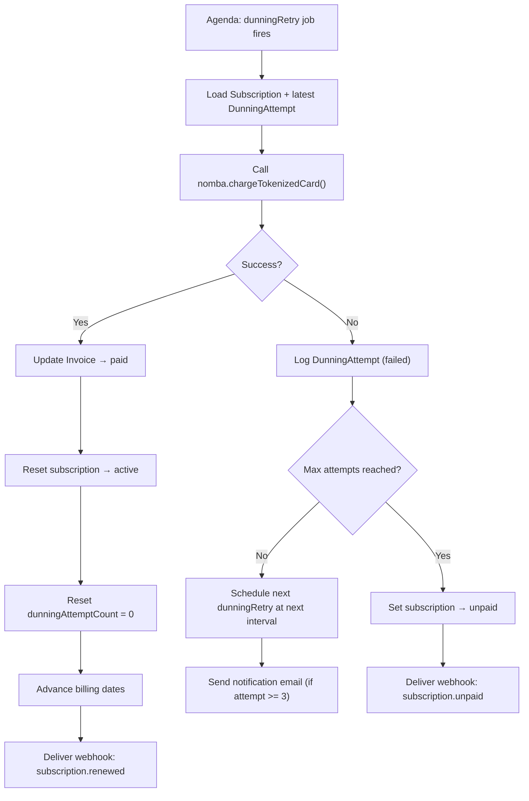

# FlexCharge Subscription Engine — Detailed Implementation Plan

> **Stack Decision**: Express 5 + TypeScript + MongoDB (Mongoose) + Agenda (job scheduler)
> **Confirmed**: We are building the **server (backend)** only for now.

---

## 1. Final Tech Stack (with justification for every dependency)

| Layer | Package | Why |
|---|---|---|
| **Web Framework** | `express@5` | Already in your `package.json`. Lightweight, battle-tested. More than capable for this. |
| **Language** | `typescript` + `tsx` | A billing engine handles money. Type safety prevents entire classes of bugs (wrong status strings, missing fields). `tsx` lets us run TS directly without a build step during dev. |
| **Database ORM** | `mongoose@9` | Already installed. Excellent for MongoDB with built-in schema validation and middleware hooks. |
| **Validation** | `zod` | Runtime validation for every API request body and webhook payload. Generates types automatically. |
| **Authentication** | `jsonwebtoken` + `bcryptjs` | JWT for stateless API key auth (downstream tenant teams). Bcrypt for hashing secrets. |
| **Job Scheduler** | `agenda` | Uses MongoDB as its backing store — no Redis needed. Perfect for daily billing scans and dunning retries. |
| **HTTP Client** | `axios` | For calling Nomba APIs and delivering outgoing webhooks. |
| **Webhook Security** | `crypto` (built-in) | HMAC-SHA256 for verifying incoming Nomba webhooks and signing our outgoing webhooks. |
| **Logging** | `pino` | Structured JSON logging. Essential for debugging payment flows in production. |
| **Rate Limiting** | `express-rate-limit` | Protect API from abuse. |
| **CORS** | `cors` | Allow frontend portal / downstream apps to call our API. |
| **Environment** | `dotenv` | Already installed. Loads `.env` config. |
| **Dev** | `nodemon`, `@types/*` | Hot reload during development. |

> [!NOTE]
> We do NOT need Redis, RabbitMQ, or any external queue. Agenda stores jobs directly in MongoDB, which keeps our infrastructure simple for a hackathon while still being production-grade.

---

## 2. Project Folder Structure

```
server/
├── src/
│   ├── config/
│   │   ├── database.ts          # MongoDB connection setup
│   │   ├── agenda.ts            # Agenda instance + job definitions
│   │   └── environment.ts       # Typed env var loader (using Zod)
│   │
│   ├── models/
│   │   ├── Tenant.ts            # Multi-tenant: the downstream team/org
│   │   ├── ApiKey.ts            # API keys issued to tenants
│   │   ├── Customer.ts          # End customers who subscribe
│   │   ├── Plan.ts              # Subscription plans
│   │   ├── Subscription.ts      # Core: links customer → plan → token
│   │   ├── Invoice.ts           # Every charge attempt (success or fail)
│   │   ├── DunningAttempt.ts    # Failed payment retry log
│   │   └── WebhookDelivery.ts   # Outgoing webhook delivery log
│   │
│   ├── routes/
│   │   ├── auth.routes.ts       # POST /auth/register, /auth/login, /auth/api-keys
│   │   ├── plan.routes.ts       # CRUD for plans
│   │   ├── subscription.routes.ts # Create, get, change-plan, cancel
│   │   ├── customer.routes.ts   # Customer management
│   │   ├── invoice.routes.ts    # List invoices
│   │   ├── webhook.routes.ts    # Receive Nomba webhooks (incoming)
│   │   └── portal.routes.ts     # Customer self-service endpoints
│   │
│   ├── controllers/
│   │   ├── auth.controller.ts
│   │   ├── plan.controller.ts
│   │   ├── subscription.controller.ts
│   │   ├── customer.controller.ts
│   │   ├── invoice.controller.ts
│   │   ├── webhook.controller.ts
│   │   └── portal.controller.ts
│   │
│   ├── services/
│   │   ├── nomba.service.ts     # All Nomba API calls (auth, checkout, charge, verify)
│   │   ├── billing.service.ts   # Core billing logic (charge, renew, prorate)
│   │   ├── dunning.service.ts   # Retry logic for failed payments
│   │   ├── webhook.service.ts   # Deliver outgoing webhooks to tenants
│   │   └── subscription.service.ts # State machine transitions
│   │
│   ├── middleware/
│   │   ├── authenticate.ts      # Verify JWT / API key on every request
│   │   ├── tenantScope.ts       # Ensure tenant can only see their own data
│   │   ├── validate.ts          # Generic Zod validation middleware
│   │   ├── errorHandler.ts      # Centralized error handler
│   │   └── rateLimiter.ts       # Rate limiting config
│   │
│   ├── jobs/
│   │   ├── dailyBillingScan.ts  # Agenda job: find & charge due subscriptions
│   │   ├── dunningRetry.ts      # Agenda job: retry a specific failed charge
│   │   ├── webhookDelivery.ts   # Agenda job: deliver outgoing webhook (with retries)
│   │   └── tokenRefresh.ts      # Agenda job: refresh Nomba access token before expiry
│   │
│   ├── validators/
│   │   ├── plan.validator.ts    # Zod schemas for plan endpoints
│   │   ├── subscription.validator.ts
│   │   ├── customer.validator.ts
│   │   └── auth.validator.ts
│   │
│   ├── utils/
│   │   ├── apiResponse.ts       # Standardized { success, data, error } response helper
│   │   ├── idempotency.ts       # Idempotency key helper for payment operations
│   │   ├── proration.ts         # Calculate prorated amounts
│   │   ├── hmac.ts              # HMAC signing/verification helpers
│   │   └── logger.ts            # Pino logger instance
│   │
│   ├── types/
│   │   ├── nomba.types.ts       # Type definitions for Nomba API req/res
│   │   ├── subscription.types.ts # Enums, status types
│   │   └── express.d.ts         # Extend Express Request with tenant/user
│   │
│   └── app.ts                   # Express app setup (middleware, routes, error handler)
│
├── index.ts                     # Entry point: connect DB → start Agenda → listen
├── tsconfig.json
├── package.json
├── .env.example
└── .gitignore
```

---

## 3. Database Models (Complete Field-Level Detail)

### 3.1 Tenant (the downstream team using your engine)

```
Tenant {
  _id:            ObjectId
  name:           String, required        // "Acme Corp"
  email:          String, required, unique // admin email
  passwordHash:   String, required        // bcrypt hash
  webhookUrl:     String                  // where we send events
  webhookSecret:  String                  // HMAC key for signing outgoing webhooks
  nombaAccountId: String                  // their Nomba account ID (if they have one)
  isActive:       Boolean, default: true
  createdAt:      Date
  updatedAt:      Date
}
```

### 3.2 ApiKey (issued to tenants for API access)

```
ApiKey {
  _id:        ObjectId
  tenantId:   ObjectId → Tenant, required
  keyHash:    String, required          // bcrypt hash of the actual key
  prefix:     String, required          // first 8 chars for identification (e.g. "fck_live_")
  name:       String                    // "Production Key"
  lastUsedAt: Date
  expiresAt:  Date
  isActive:   Boolean, default: true
  createdAt:  Date
}
```

### 3.3 Customer (end user who subscribes)

```
Customer {
  _id:          ObjectId
  tenantId:     ObjectId → Tenant, required
  email:        String, required
  name:         String
  phone:        String
  metadata:     Mixed (JSON)             // arbitrary data from downstream team
  createdAt:    Date
  updatedAt:    Date
}
// Compound unique index: { tenantId, email }
```

### 3.4 Plan

```
Plan {
  _id:          ObjectId
  tenantId:     ObjectId → Tenant, required
  name:         String, required          // "Pro Monthly"
  slug:         String, required          // "pro-monthly"
  description:  String
  amount:       Number, required          // in kobo (smallest unit), e.g. 500000 = ₦5,000
  currency:     String, default: "NGN"
  interval:     Enum: "monthly" | "quarterly" | "yearly" | "weekly"
  intervalDays: Number                    // custom interval override (e.g. 90)
  trialDays:    Number, default: 0
  features:     [String]                  // ["10 users", "5GB storage"]
  isActive:     Boolean, default: true
  createdAt:    Date
  updatedAt:    Date
}
```

### 3.5 Subscription (the core entity)

```
Subscription {
  _id:                    ObjectId
  tenantId:               ObjectId → Tenant, required
  customerId:             ObjectId → Customer, required
  planId:                 ObjectId → Plan, required

  // === STATE MACHINE ===
  status:                 Enum: "trialing" | "active" | "past_due" | "canceled" | "unpaid" | "paused"

  // === NOMBA TOKEN ===
  tokenKey:               String              // from Nomba tokenization
  cardLast4:              String              // last 4 digits for display
  cardBrand:              String              // "Visa", "Mastercard"

  // === BILLING PERIODS ===
  currentPeriodStart:     Date
  currentPeriodEnd:     Date
  nextBillingDate:        Date
  trialEnd:               Date                // null if no trial

  // === CANCELLATION ===
  cancelAtPeriodEnd:      Boolean, default: false
  canceledAt:             Date
  cancellationReason:     String

  // === DUNNING ===
  dunningAttemptCount:    Number, default: 0
  lastDunningAt:          Date

  // === CHECKOUT ===
  nombaCheckoutOrderRef:  String              // reference from initial checkout
  checkoutLink:           String              // Nomba hosted payment page URL

  // === META ===
  metadata:               Mixed
  createdAt:              Date
  updatedAt:              Date
}
// Indexes: { tenantId, status }, { nextBillingDate, status }, { customerId }
```

### 3.6 Invoice (every charge attempt, successful or not)

```
Invoice {
  _id:                  ObjectId
  tenantId:             ObjectId → Tenant
  subscriptionId:       ObjectId → Subscription
  customerId:           ObjectId → Customer

  amount:               Number, required       // in kobo
  currency:             String, default: "NGN"
  status:               Enum: "pending" | "paid" | "failed" | "refunded"

  // === NOMBA REFERENCES ===
  nombaOrderReference:  String
  nombaTransactionId:   String
  nombaTransactionRef:  String

  // === DETAILS ===
  description:          String                  // "Pro Monthly — July 2026"
  paidAt:               Date
  failureReason:        String
  isRenewal:            Boolean, default: false  // true if auto-billed
  idempotencyKey:       String, unique           // prevent double charges

  createdAt:            Date
}
```

### 3.7 DunningAttempt (tracks each retry for a failed payment)

```
DunningAttempt {
  _id:              ObjectId
  subscriptionId:   ObjectId → Subscription
  invoiceId:        ObjectId → Invoice
  attemptNumber:    Number                   // 1, 2, 3...
  scheduledFor:     Date                     // when this retry is planned
  executedAt:       Date                     // when it actually ran
  status:           Enum: "scheduled" | "succeeded" | "failed" | "skipped"
  failureReason:    String
  nextRetryAt:      Date                     // null if this was the last attempt
  createdAt:        Date
}
```

### 3.8 WebhookDelivery (outgoing events to downstream tenants)

```
WebhookDelivery {
  _id:            ObjectId
  tenantId:       ObjectId → Tenant
  event:          String                   // "subscription.renewed", "payment.failed"
  payload:        Mixed                    // the JSON we sent
  url:            String                   // tenant's webhook URL
  status:         Enum: "pending" | "delivered" | "failed"
  httpStatus:     Number                   // 200, 500, etc.
  attempts:       Number, default: 0
  maxAttempts:    Number, default: 5
  lastAttemptAt:  Date
  nextRetryAt:    Date
  response:       String                   // truncated response body
  createdAt:      Date
}
```

---

## 4. Authentication & Multi-Tenancy (Detailed)

This system has **two layers** of auth:

### Layer 1: Tenant Authentication (downstream teams calling our API)



**How the `authenticate` middleware works:**
1. Check for `x-api-key` header first (API key auth for programmatic access).
2. If not present, check for `Authorization: Bearer <jwt>` (session auth for dashboard/portal).
3. If neither, return `401 Unauthorized`.
4. On success, attach `req.tenant` (the Tenant document) to the request.

**How `tenantScope` middleware works:**
- Every database query automatically filters by `tenantId = req.tenant._id`.
- A tenant can NEVER see another tenant's plans, customers, or subscriptions.
- This is enforced at the middleware level, not the controller level, so it's impossible to forget.

### Layer 2: Customer Authentication (end-users managing their subscriptions)

For the self-service portal:
- Tenant calls `POST /portal/sessions` with a `customerId` → we generate a short-lived JWT scoped to that customer.
- The customer uses this token to access portal endpoints (view subscription, update card, cancel).
- This is similar to how Stripe's Customer Portal works — the tenant generates a session link.

---

## 5. Nomba Integration Service (Complete Detail)

### 5.1 Nomba Auth (Token Management)

```
nomba.service.ts

- obtainAccessToken(): 
    POST https://api.nomba.com/v1/auth/token/issue
    Headers: { Content-Type: application/json, accountId: NOMBA_ACCOUNT_ID }
    Body: { grant_type: "client_credentials", client_id, client_secret }
    Returns: { access_token, refresh_token, expires_in }
    
- refreshAccessToken():
    Uses refresh_token to get a new access_token before expiry.
    
- getValidToken():
    Returns cached token if still valid, otherwise refreshes.
    We store the token in memory + schedule an Agenda job to refresh before expiry.
```

### 5.2 Checkout (First Payment + Tokenization)

```
- createCheckoutOrder(params):
    POST https://api.nomba.com/v1/checkout/order
    Headers: { Authorization: Bearer <token>, accountId: NOMBA_ACCOUNT_ID }
    Body: {
      order: {
        orderReference: "sub_<subscriptionId>_<timestamp>",
        amount: "5000.00",
        currency: "NGN",
        customerEmail: "user@example.com",
        callbackUrl: "https://yourserver.com/webhooks/nomba"
      },
      tokenizeCard: true
    }
    Returns: { checkoutLink, orderReference }
```

### 5.3 Charge Tokenized Card (Recurring Billing)

```
- chargeTokenizedCard(params):
    POST https://api.nomba.com/v1/checkout/tokenized-card-payment
    Headers: { Authorization: Bearer <token>, accountId: NOMBA_ACCOUNT_ID }
    Body: {
      tokenKey: "<saved_token_key>",
      order: {
        orderReference: "inv_<invoiceId>",
        amount: "5000.00",
        currency: "NGN",
        customerEmail: "user@example.com",
        customerId: "<customer_id>",
        accountId: NOMBA_ACCOUNT_ID
      }
    }
    Returns: { status, transactionId }
```

### 5.4 Verify Transaction

```
- verifyTransaction(orderReference):
    GET https://api.nomba.com/v1/transactions/accounts/single?orderReference=<ref>
    Headers: { Authorization: Bearer <token>, accountId: NOMBA_ACCOUNT_ID }
    Returns: { data: { status: "SUCCESS" | "FAILED" | "PENDING", ... } }
```

### 5.5 Incoming Webhook Verification

```
- verifyWebhookSignature(payload, signature, secret):
    Compute HMAC-SHA256 of raw body using our webhook signature key.
    Compare against the `nomba-sig-value` header.
    Headers to check: nomba-signature, nomba-sig-value, nomba-signature-algorithm, nomba-timestamp.
```

---

## 6. Core Workflows (Step-by-Step)

### 6.1 New Subscription (Checkout Flow)



### 6.2 Daily Billing Scan (Recurring Charges)



### 6.3 Smart Dunning (Failed Payment Recovery)

```
Dunning Schedule:
  Attempt 1: Immediate (the initial charge failure)
  Attempt 2: +1 day   → charge again
  Attempt 3: +3 days  → charge again + send email "Update your card"
  Attempt 4: +7 days  → charge again + send final warning email
  Attempt 5: +14 days → FINAL attempt

  If all 5 fail:
    → Set subscription status = "unpaid"
    → Deliver webhook: "subscription.unpaid"
    → Stop charging
```



### 6.4 Plan Change (Upgrade/Downgrade with Proration)

```
1. Customer requests plan change (via portal or tenant API)
2. Calculate proration:
   - daysRemaining = (currentPeriodEnd - today) in days
   - totalDaysInPeriod = (currentPeriodEnd - currentPeriodStart) in days
   - unusedCredit = (daysRemaining / totalDaysInPeriod) * oldPlanAmount
   - newPlanCostForRemaining = (daysRemaining / totalDaysInNewPeriod) * newPlanAmount
   - amountDue = newPlanCostForRemaining - unusedCredit

3. If amountDue > 0 (upgrade):
   → Charge the difference immediately via tokenized card
   → Create Invoice for the prorated amount

4. If amountDue < 0 (downgrade):
   → Store as credit on the subscription
   → Apply credit to next billing cycle

5. Update subscription: planId → newPlan
6. Deliver webhook: "subscription.updated"
```

### 6.5 Cancellation

```
Two modes:
  A) Cancel at period end (graceful):
     → Set cancelAtPeriodEnd = true
     → Subscription stays "active" until currentPeriodEnd
     → Daily billing scan sees cancelAtPeriodEnd and skips charging
     → At period end, status → "canceled"
     → Deliver webhook: "subscription.canceled"

  B) Cancel immediately:
     → Status → "canceled" right now
     → Optionally calculate refund for unused days
     → Deliver webhook: "subscription.canceled"
```

### 6.6 Card Update (Replace Payment Method)

```
1. Customer or tenant calls POST /portal/update-payment-method
2. FlexCharge creates a new Nomba checkout order with tokenizeCard: true, amount: "50" (small auth charge)
3. Return checkoutLink to customer
4. Customer pays small amount on Nomba page
5. Nomba sends webhook with NEW tokenKey
6. FlexCharge updates the subscription's tokenKey
7. If subscription was "past_due", optionally trigger immediate charge retry
```

---

## 7. Complete REST API Surface

### Auth & Tenant Management
| Method | Endpoint | Description | Auth |
|--------|----------|-------------|------|
| `POST` | `/auth/register` | Register a new tenant | None |
| `POST` | `/auth/login` | Login, receive JWT | None |
| `POST` | `/auth/api-keys` | Generate an API key | JWT |
| `GET` | `/auth/api-keys` | List tenant's API keys | JWT |
| `DELETE` | `/auth/api-keys/:id` | Revoke an API key | JWT |

### Plans
| Method | Endpoint | Description | Auth |
|--------|----------|-------------|------|
| `POST` | `/plans` | Create a new plan | API Key |
| `GET` | `/plans` | List all plans for tenant | API Key |
| `GET` | `/plans/:id` | Get plan details | API Key |
| `PATCH` | `/plans/:id` | Update plan (name, amount, active) | API Key |
| `DELETE` | `/plans/:id` | Soft-delete (deactivate) a plan | API Key |

### Customers
| Method | Endpoint | Description | Auth |
|--------|----------|-------------|------|
| `POST` | `/customers` | Create / register a customer | API Key |
| `GET` | `/customers` | List customers (paginated) | API Key |
| `GET` | `/customers/:id` | Get customer details + active sub | API Key |
| `PATCH` | `/customers/:id` | Update customer info | API Key |

### Subscriptions
| Method | Endpoint | Description | Auth |
|--------|----------|-------------|------|
| `POST` | `/subscriptions` | Create subscription + get checkout link | API Key |
| `GET` | `/subscriptions` | List subscriptions (filterable by status) | API Key |
| `GET` | `/subscriptions/:id` | Get subscription detail | API Key |
| `POST` | `/subscriptions/:id/change-plan` | Change to a different plan (proration) | API Key |
| `POST` | `/subscriptions/:id/cancel` | Cancel subscription | API Key |
| `POST` | `/subscriptions/:id/pause` | Pause subscription | API Key |
| `POST` | `/subscriptions/:id/resume` | Resume paused subscription | API Key |

### Invoices
| Method | Endpoint | Description | Auth |
|--------|----------|-------------|------|
| `GET` | `/invoices` | List invoices (filterable) | API Key |
| `GET` | `/invoices/:id` | Get invoice detail | API Key |

### Webhooks (Incoming from Nomba)
| Method | Endpoint | Description | Auth |
|--------|----------|-------------|------|
| `POST` | `/webhooks/nomba` | Receive Nomba payment events | HMAC signature |

### Customer Portal (Self-Service)
| Method | Endpoint | Description | Auth |
|--------|----------|-------------|------|
| `POST` | `/portal/sessions` | Generate a portal session for a customer | API Key |
| `GET` | `/portal/subscription` | Customer views their subscription | Portal JWT |
| `GET` | `/portal/invoices` | Customer views their invoices | Portal JWT |
| `POST` | `/portal/update-payment-method` | Get link to update card | Portal JWT |
| `POST` | `/portal/cancel` | Customer cancels their subscription | Portal JWT |

---

## 8. Agenda Job Definitions

| Job Name | Schedule | Description |
|----------|----------|-------------|
| `daily-billing-scan` | Every 1 hour | Finds active subscriptions due for billing and charges them |
| `dunning-retry` | One-shot (scheduled per failure) | Retries a specific failed charge after delay |
| `webhook-delivery` | One-shot (scheduled per event) | Delivers an outgoing webhook to a tenant's URL |
| `webhook-delivery-retry` | One-shot (on delivery failure) | Retries a failed webhook delivery (exponential backoff) |
| `nomba-token-refresh` | Every 45 minutes | Refreshes the Nomba API access token before it expires |
| `expire-pending-subscriptions` | Every 6 hours | Cleans up subscriptions stuck in "pending" (checkout never completed) |
| `cancel-at-period-end` | Every 1 hour | Finds subscriptions with cancelAtPeriodEnd=true past their period end, marks as canceled |

---

## 9. Outgoing Webhook System (for Downstream Teams)

### Events We Emit

| Event | Triggered When |
|-------|---------------|
| `subscription.created` | Subscription activated after first payment |
| `subscription.renewed` | Recurring charge succeeded |
| `subscription.updated` | Plan changed, paused, resumed |
| `subscription.payment_failed` | Charge failed (dunning started) |
| `subscription.past_due` | Subscription entered past_due state |
| `subscription.canceled` | Subscription canceled |
| `subscription.unpaid` | All dunning attempts exhausted |
| `invoice.paid` | An invoice was paid |
| `invoice.failed` | An invoice payment failed |
| `customer.created` | New customer registered |

### Delivery Logic
1. When an event occurs, create a `WebhookDelivery` record (status: `pending`).
2. Schedule an Agenda job `webhook-delivery` to POST the payload to the tenant's `webhookUrl`.
3. Sign the payload with HMAC-SHA256 using the tenant's `webhookSecret`.
4. Include headers: `x-flexcharge-signature`, `x-flexcharge-timestamp`, `x-flexcharge-event`.
5. If delivery fails (non-2xx response or timeout), schedule a retry with exponential backoff (1min, 5min, 30min, 2h, 24h).
6. After 5 failed attempts, mark delivery as `failed` and stop.

### Payload Format
```json
{
  "id": "evt_abc123",
  "event": "subscription.renewed",
  "timestamp": "2026-06-24T09:00:00Z",
  "data": {
    "subscriptionId": "sub_xyz",
    "customerId": "cus_123",
    "planId": "plan_456",
    "status": "active",
    "amount": 500000,
    "currency": "NGN",
    "currentPeriodStart": "2026-06-24",
    "currentPeriodEnd": "2026-07-24"
  }
}
```

---

## 10. Security Hardening

| Area | Implementation |
|------|---------------|
| **API Key Storage** | Never store raw keys. Store bcrypt hash + prefix for lookup. Show key only once on creation. |
| **Card Data** | NEVER touch or store card numbers. Only store Nomba `tokenKey`, `cardLast4`, `cardBrand`. |
| **Webhook Verification (Incoming)** | Verify HMAC-SHA256 signature on every Nomba webhook. Reject if invalid. |
| **Webhook Signing (Outgoing)** | Sign all outgoing webhooks with tenant's `webhookSecret` using HMAC-SHA256. |
| **Transaction Verification** | ALWAYS call Nomba's verify endpoint after webhook AND after charging. Never trust webhook alone. |
| **Idempotency** | Generate unique idempotency keys for every charge (`bill_{subId}_{periodEnd}`). Prevent double billing. |
| **Rate Limiting** | 100 req/min per API key for general endpoints. 10 req/min for auth endpoints. |
| **Input Validation** | Zod validation on every request body. Reject malformed input before it hits the controller. |
| **Tenant Isolation** | Every query is scoped by `tenantId`. Middleware enforces this. Cross-tenant access is impossible. |
| **Environment Variables** | All secrets in `.env`. Validated at startup with Zod (crash early if missing). |
| **Logging** | Pino structured logs. Never log tokens, keys, or card data. Mask sensitive fields. |
| **CORS** | Restrict origins in production. |
| **Helmet** | Use `helmet` middleware for security headers. |

---

## 11. Environment Variables

```env
# Server
PORT=7000
NODE_ENV=development

# MongoDB
MONGO_URL=mongodb://localhost:27017/flexcharge

# Nomba API
NOMBA_BASE_URL=https://sandbox.nomba.com
NOMBA_CLIENT_ID=your_client_id
NOMBA_CLIENT_SECRET=your_client_secret
NOMBA_ACCOUNT_ID=your_account_id
NOMBA_WEBHOOK_SECRET=your_webhook_signature_key

# Auth
JWT_SECRET=your_jwt_secret_here
JWT_EXPIRES_IN=24h
PORTAL_JWT_SECRET=different_secret_for_portal
PORTAL_JWT_EXPIRES_IN=1h

# App
API_BASE_URL=http://localhost:7000
```

---

## 12. Execution Plan (Phased)

### Phase 1: Foundation & Config ⏱️ ~2 hours
- [ ] Convert project to TypeScript (add `tsconfig.json`, rename files, add `tsx`)
- [ ] Create folder structure as defined above
- [ ] Set up `environment.ts` with Zod validation of all env vars
- [ ] Set up `database.ts` with Mongoose connection
- [ ] Set up `app.ts` with Express middleware stack (cors, helmet, json parser, rate limiter, error handler)
- [ ] Set up `logger.ts` with Pino
- [ ] Create `apiResponse.ts` utility
- [ ] Install all dependencies

### Phase 2: Auth & Multi-Tenancy ⏱️ ~2 hours
- [ ] Create `Tenant` and `ApiKey` models
- [ ] Build `auth.routes.ts` + `auth.controller.ts` (register, login, API key CRUD)
- [ ] Build `authenticate.ts` middleware (JWT + API key)
- [ ] Build `tenantScope.ts` middleware
- [ ] Build `validate.ts` middleware (generic Zod)
- [ ] Test: register a tenant, login, generate API key, make authenticated request

### Phase 3: Plans & Customers ⏱️ ~1.5 hours
- [ ] Create `Plan` and `Customer` models
- [ ] Build CRUD endpoints for Plans
- [ ] Build CRUD endpoints for Customers
- [ ] Add Zod validators for both
- [ ] Test: create plans, create customers via API key

### Phase 4: Nomba Service & Subscription Creation ⏱️ ~3 hours
- [ ] Build `nomba.service.ts` (auth token management, checkout, charge, verify)
- [ ] Create `Subscription` and `Invoice` models
- [ ] Build `POST /subscriptions` — creates subscription + Nomba checkout
- [ ] Build `POST /webhooks/nomba` — receives payment events, verifies, activates subscription
- [ ] Build `GET /subscriptions` and `GET /subscriptions/:id`
- [ ] Test end-to-end: create subscription → pay on Nomba sandbox → webhook activates it

### Phase 5: Billing Engine (Agenda Jobs) ⏱️ ~3 hours
- [ ] Set up Agenda in `config/agenda.ts`
- [ ] Build `dailyBillingScan.ts` job
- [ ] Build `billing.service.ts` (charge logic + period advancement)
- [ ] Build `tokenRefresh.ts` job
- [ ] Build `expire-pending-subscriptions` job
- [ ] Build `cancel-at-period-end` job
- [ ] Test: manually trigger billing scan, verify charges go through

### Phase 6: Dunning & Recovery ⏱️ ~2 hours
- [ ] Create `DunningAttempt` model
- [ ] Build `dunning.service.ts` (retry scheduling logic)
- [ ] Build `dunningRetry.ts` Agenda job
- [ ] Integrate dunning into billing failure flow
- [ ] Test: simulate failed charge → verify retry schedule → verify status transitions

### Phase 7: Outgoing Webhooks & Portal ⏱️ ~2.5 hours
- [ ] Create `WebhookDelivery` model
- [ ] Build `webhook.service.ts` (signing, delivery, retry)
- [ ] Build `webhookDelivery.ts` Agenda job
- [ ] Integrate webhook delivery into all flows (subscription created, renewed, failed, etc.)
- [ ] Build portal endpoints (session creation, view sub, cancel, update card)
- [ ] Build `POST /subscriptions/:id/change-plan` with proration
- [ ] Test: full flow with webhook delivery to a test endpoint

---

## Verification Plan

### Automated Tests
```bash
# We can add basic integration tests using the Nomba sandbox
npm run test
```
- Test Nomba service methods against sandbox API
- Test subscription creation flow end-to-end
- Test dunning retry logic with mocked Nomba responses
- Test webhook signature verification

### Manual Verification
- Use Postman/Thunder Client to test every endpoint
- Use Nomba sandbox to test real payment flows
- Verify webhook delivery to a test URL (e.g., webhook.site)
- Verify Agenda jobs run on schedule (check MongoDB `agendaJobs` collection)
- Test edge cases: double billing prevention, expired tokens, concurrent charges

---

## Open Questions

> [!IMPORTANT]
> **1. Nomba Sandbox Credentials**: Do you already have Nomba sandbox API credentials (`client_id`, `client_secret`, `account_id`)? We need these to test the integration.

> [!IMPORTANT]
> **2. TypeScript Confirmation**: The plan converts the project to TypeScript. This means renaming `index.js` → `index.ts` and using `tsx` to run it. Are you and your teammate comfortable with this?

> [!NOTE]
> **3. Email/SMS Notifications**: The dunning system mentions sending emails. Do you want to integrate an email service (e.g., Resend, Nodemailer) now, or leave that as a placeholder for later?

> [!NOTE]
> **4. Deployment**: Where are you planning to deploy? (Render, Railway, Vercel, etc.) This affects how Agenda (the job scheduler) runs, since it needs a persistent process.
